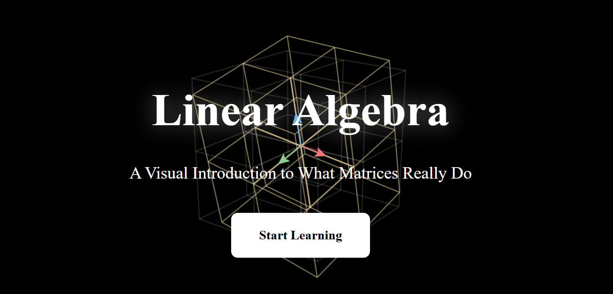

# Linear Algebra Lab – Interactive Learning Environment

**Linear Algebra Lab** is an interactive web-based learning project designed to help students intuitively understand core concepts in linear algebra through visualization and experimentation. Instead of focusing only on symbolic manipulation, this project emphasizes conceptual understanding by allowing users to interact with vectors, matrices, and transformations in real time.

---

## About the Creator

I'm Yunqi Wang, a final-year student majoring in Artificial Intelligence and Educational Technology.  
I'm an aspiring educator and researcher who is passionate about human-inspired AI and its potential to support learning and wellbeing.   I enjoy exploring how technology can better understand people, how we think, feel, and grow, and turning those insights into tools that are practical, ethical, and learner-centered.   With strong communication skills and a genuine love for teaching, I aim to create engaging learning experiences where students feel supported, curious, and confident.

---

## Project Overview

Linear algebra is foundational for modern fields such as machine learning, computer graphics, robotics, and data science, yet many learners struggle because the subject is often taught abstractly. This project aims to bridge that gap by providing:

- visual explanations of abstract concepts  
- interactive manipulation of mathematical objects  
- experiential learning before formal theory  
- intuitive understanding of how matrices operate in space  

---

## Features

### 1️⃣ Basis Vectors Module
- Interactive canvas to manipulate basis vectors î and ĵ  
- Real-time visualization of vector decomposition  
- Demonstration of span, linear independence, and coordinate systems  
- Adjustable sliders for exploring different bases  

### 2️⃣ Linear Transformation Module
- Matrix input for real-time space transformation  
- Visualization of grid deformation under transformations  
- Determinant calculation and display  
- Preset transformations:
  - Rotation  
  - Scaling  
  - Shear  
  - Reflection  
  - Projection  
- Animation controls for observing transformation processes  

### 3️⃣ Conceptual Explanation Sections
Each module includes structured learning content:
- observation prompts  
- theoretical explanations  
- key mathematical properties  
- real-world applications in graphics, robotics, and machine learning  

---

## Tech Stack

- HTML5  
- CSS3  
- JavaScript  
- Canvas API for visualization  
- MathJax for mathematical notation rendering  

---

## Learning Design Philosophy

We follow Kolb's Experiential Learning Cycle, a proven educational framework that emphasizes learning through experience and reflection.

David Kolb's theory proposes that learning is most effective when it follows a four-stage cycle: experiencing concrete situations, observing and reflecting on those experiences, forming abstract concepts, and actively experimenting with new ideas. This hands-on approach helps learners build deep and lasting understanding.

In this project, interactive visual exploration comes first, followed by guided observation, conceptual explanation, and opportunities for experimentation, allowing learners to construct knowledge through action rather than passive memorization.

---

## How to Run

1. Clone the repository  
2. Open `index.html` in a browser  
3. Navigate between modules:
   - Basis Vectors  
   - Linear Transformation  

No additional installation is required.

 Integration with AI-driven tutoring  

---

## License

This project is for educational and research purposes. Contributions and suggestions are welcome.
